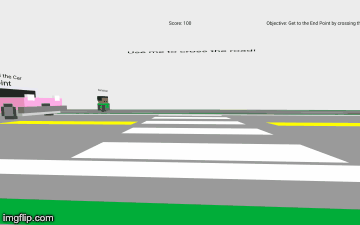

# 🏗️ Safe Riding Virtual Reality
An virtual reality project to simulate a realistic experience of riding in Singapore built with A-Frame. 
The application “Safe Riding Trainer”, serves as a Virtual Reality (VR) simulator that provides users with an immersive experience as a cyclist or Personal Mobility Device (PMD) user. The simulator hopes to promote safe riding in Singapore through a series of tutorials and games that takes place on the roads of Singapore. This includes teaching users the fundamental cycling rules along with safe riding etiquettes. The game will also test the user’s awareness to obstructions and ability to foresee an accident. The application is meant for anyone to try including non-cyclists. This is to allow the public in general to empathize with the cyclists on the road. The application will be limited to a single player game. This document will consist of the design specification for the application.

## How to run
Play the game on a computer or mobile application by clicking this link. <b><a href="adrianfoo.github.io"> >> Play Game<< </a></b>

Virtual Reality can be played using computer with keyboards and mouse for movement.
It can also be played by clicking the link on a mobile phone and slotting it into a Google Cardboard Glasses.
(Mobile phone needs to be connected to a keyboard in order to move.)

Video of Gameplay: <b><a href="https://youtu.be/hOtEkcEMO98"> >> Video<< </a></b>

## Player Basic Control 
Movement Control
* W - Move forward
* A - Move left
* S - Move backward
* D - Move right

Action Control
Space Bar - Do action (only available on clickable object)
Mouse Click for Web - Do action (only available on clickable object)

View Control
VR Mode:
1. Attach your mobile device to Google Cardboard or any other VR headset 
2. Look around

Web Browser Mode:
1. Hover your mouse to look around. 

## Screenshots

## Scores
Every player starts off with 100 points in every scenario. Every time the player breaks a rule in the game, the points will be deducted.

- Cycling on the wrong path: -1 point/second
- Hits a vehicle: -10 points
- Hits a pedestrian: -10 points

The game ends when the points hits zero. Player can check the score in the Score page.

## Player step by step guide
1. Login with following credentials
    - Username: player
    - Password: player123
2. Select Settings to change brightness or volume.
3. View Tutorial for new player
4. View Score for existing player
5. Select Level
    - Level 1: Easy mode (Cycle along a path)
    - Level 2: Intermediate (Cycle across the road)
    - Level 3: Hard (Cycle across the road with traffic)
6. Play Game

## Admin step by step guide
1. Login with following credentials
- Username: admin
- Password: admin123
2. Set rate of vehicles being generated (By percentage)
3. Set rate of pedestrians being generated (By percentage)
4. Set envronment (Day/Night)
5. Update game by clicking on 'Modify Game Setting' button

## Credits
* most models made by Mike Judge, see more here: https://github.com/mikelovesrobots/mmmm
* table http://tf3dm.com/3d-model/table-65702.html
* tree and simple base plates created by kfarr using magicavoxel (https://ephtracy.github.io/)
* city builder text based on https://github.com/ngokevin/kframe/blob/master/components/text/examples/vaporwave/index.html
* vox/kfarr_veh_tram_avenio.vox inspired by https://sketchfab.com/models/7e3d9f90af9447dabcb813a4af43ae76

## License
* The A-Frame City Builder codebase is MIT License Copyright (c) 2017 Kieran Farr
* Most nice looking objects are made by Mike Judge from his <a href="https://github.com/mikelovesrobots/mmmm">"Mini Mike's Metro Minis" project</a> under the <a href="https://github.com/mikelovesrobots/mmmm/blob/master/LICENSE">Creative Commons License.</a>
